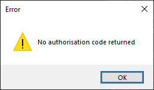

# AIKEJI.Xero.OAuth2.Docs

<!-- TOC -->

1. [Description](#description)
2. [Release Notes](#release-notes)
3. [Features](#features)
4. [Dependencies](#dependencies)
5. [Installation & Setup](#installation--setup)
6. [Steps](#steps)
7. [Usage with Xero's API](#usage-with-xeros-api)
8. [How It Works](#how-it-works)
9. [Code & Usage](#code--usage)
10. [Compatibility](#compatibility)
11. [Licence](#licence)
12. [Support](#support)
13. [Contact Us](#contact-us)
14. [Request Trial Licence](#request-trial-licence)
15. [Purchase Licence](#purchase-licence)
16. [Troubleshooting](#troubleshooting)

<!-- /TOC -->

## Description

This library is a `.NET` library that presents a simplified API for retrieving access tokens using `Xero`'s OAuth2 API with an integrated login experience using an embedded browser. This library can be used by any Windows `.NET` desktop application, however is most useful for applications using WinForms or WPF (Windows Presentation Foundation). Our library enables your application to easily authenticate with `Xero`, reducing development effort and complexity of implementation.

## Release Notes

[Release Notes](release-notes.md)

## Features

* Pop up elegant login form with embedded browser for `Xero` login.
* Automatically get, save, and refresh token with a single method call.
* Automatically save token to encrypted file.
* Automatically load token from file.
* Automatically refresh token when expired or close to expiry.

## Dependencies

The library is dependant on the `.NET Framework v4.6`.\
\
It also has a dependency on the nuget package `CefSharp.Winforms`.\
This is bundled inside the nuget package to aid in ease of use.

Because of how the `CefSharp` redistributables are packaged, we have decided to package these dependencies directly into our nuget package, rather than let nuget try to work out how to reference files, which can differ depending on whether your project uses `packages.config` or `PackageReference` style references.\
This means that you will get both x86 and x64 dependencies for a project targeting `Any CPU`, but only the relevant architecture when targeting `x86` or `x64`.\
However due to keeping the package flexible, the package size is increased.

## Installation & Setup

The library is provided on [nuget.org](https://nuget.org) at [https://www.nuget.org/packages/AIKEJI.Xero.OAuth2](https://www.nuget.org/packages/AIKEJI.Xero.OAuth2).\
For help on installing nuget packages, please refer to Microsoft's [documentation](https://docs.microsoft.com/en-us/nuget/quickstart/install-and-use-a-package-in-visual-studio).

All configuration is done in code, refer to the [configuration](#configuration) section and intellisense documentation for details.\
The licence file `aikeji.lic` must be placed in the same folder as your application, otherwise the library will not function.

## Steps

1. Install the `AIKEJI.Xero.OAuth2` package with nuget.\
See [Installation & Setup](#installation--setup).

2. Purchase a licence from the AIKEJI products page.\
See [Purchase Licence](#purchase-licence)

3. After receiving the licence file, place the `aikeji.lic` file into the same folder as your program.

4. Refer to configuration section on how to configure the library for your application.\
See [Configuration](#configuration).

5. Refer to sample code on how to use the library.\
See [C#](#c-sample) or [VB.Net](#vbnet-sample).

6. (Optional) Install the `Xero.NetStandard.OAuth2` package with nuget, to use `Xero`'s provided API library.\
[https://www.nuget.org/packages/Xero.NetStandard.OAuth2](https://www.nuget.org/packages/Xero.NetStandard.OAuth2)

7. (Optional) Install the `RestSharp` package with nuget, to use a generic REST client.\
[https://www.nuget.org/packages/RestSharp](https://www.nuget.org/packages/RestSharp)

## Usage with Xero's API

This library handles the OAuth2 sides of things, and allows you to easily get an access token, which is required to access Xero's API.\
This library does not handle or provide the functionality to actually access Xero's other API endpoints, such as creating a Contact or Invoice.\
Xero's API is an HTTP REST API, which means there are a few options to access it.\
For more information on Xero's API, check their website: [https://developer.xero.com/documentation/](https://developer.xero.com/documentation/)

### 1. (Advanced) Manual HTTP calls

If you understand HTTP, you can use any HTTP client, such as the `.NET` `HttpClient` to manually create HTTP requests.
You will have to add the `AccessToken` and `TenantId` as headers in each of your requests.\
See `6. Call the API`: [https://developer.xero.com/documentation/oauth2/auth-flow](https://developer.xero.com/documentation/oauth2/auth-flow)
The documentation has examples of how to do different options and has an API Previewer.\
You will also need to serialise and deserialise the requests and responses yourself.

### 2. Use a generic REST client

Similar to #1, except that the client assists in serialising for you, although you will need to create your own models.\
A popular free `.NET` REST client is RestSharp, and there are a lot of samples and examples on how to call REST APIs.

### 3. (Recommended) Use Xero's client library

Xero themselves provide a `.NET` client library via nuget
[https://github.com/XeroAPI/Xero-NetStandard](https://github.com/XeroAPI/Xero-NetStandard)\
Note that you should check what endpoints are supported, as not all of them are currently supported with the library.\
\
See the [Full Xero API C# Sample](#full-xero-api-c-sample) or [Full Xero API VB.Net Sample](#full-xero-api-vbnet-sample) for sample code.
\
Note that this library targets `netstandard 2.0`, and as such your application will need to be on `.NET Framework v4.6.1` or later.\
See: [https://docs.microsoft.com/en-us/dotnet/standard/net-standard#net-implementation-support](https://docs.microsoft.com/en-us/dotnet/standard/net-standard#net-implementation-support)

### 4. (Advanced) Generate a client library

A more advanced option is to generate your own client library.\
`NSwag Studio` provide a tool that can generate `.NET` code from an API definition.\
The tool can be found here: [https://github.com/RicoSuter/NSwag](https://github.com/RicoSuter/NSwag)\
And Xero's API definitions can be found here: [https://github.com/XeroAPI/Xero-OpenAPI](https://github.com/XeroAPI/Xero-OpenAPI)

### Recommendations

Our recommendation is to use Xero's client library if possible.\
This simplifies access to Xero's APIs, and is accessible to developers of all levels of experience.

If the Xero client library is not usable in your application for whatever reason, then using the `HttpClient` is a good option for developers familiar with `HTTP` calls.\
Otherwise `RestSharp` would be recommended, as it takes care of a lot of the `HTTP` concerns and lets you focus on coding.

## How It Works

This library provides a simple `ITokenHelper` interface to use.\
This simplifies authentication with `Xero`'s OAuth2 API, and provides a consolidated and user friendly experience.

When your application requires a token, it just has to call the `GetToken` method. If this is the first time the application has called this, a window will pop up allowing the user to log in to `Xero` and grant the application access.\
The library automatically saves this token to disk, and will load the file if present.

The library will also automatically refresh the token when it detects that the token has expired, as the tokens only last for 30 minutes (controlled by `Xero`).

The library will also cache the user's login session, if desired, to simplify the process of getting a new token if the application has not been used for a while.

### Technical Details

Xero's OAuth2 requires interactive login by a user.\
To achieve this, the library displays a WinForms Form with an embedded browser that is not dependant on the system's installed browser.

Caching of sessions is enabled by default to allow ease of login.\
This will cache the session used when logging in to the `Xero` website.\
If this is not desired, then this functionality can be disabled with the `CacheCookies` property in the `TokenHelperOptions`.\
Alternatively, the current session can be cleared using the `ClearLoginSession` method in the `ITokenHelper`.

#### Code Flow Details

When creating a Xero application, you may select either `Auth code` or `Auth code with PKCE`.\
If you are creating a new desktop application, `PKCE` is recommended due to its stronger security.\
If you already have a non-`PKCE` application, you can continue to use it.

The Xero documentation explains how the code flow works in detail.\
[https://developer.xero.com/documentation/oauth2/auth-flow](https://developer.xero.com/documentation/oauth2/auth-flow)

#### PKCE Flow Details

`PKCE` (pronounced `pixie`) is a more secure authorisation flow for mobile or desktop applications.\
It can prevent certain attacks and allows public applications to securely authenticate.\
For more details on `PKCE`, see this link: [https://oauth.net/2/pkce/](https://oauth.net/2/pkce/)

The Xero documentation explains how the `PKCE` flow works in detail.\
[https://developer.xero.com/documentation/oauth2/pkce-flow](https://developer.xero.com/documentation/oauth2/pkce-flow)

## Code & Usage

### API

The package comes with `IntelliSense` documentation, please check the documentation on interfaces and methods for help and usage.

```csharp
namespace AIKEJI.Xero.OAuth2
{
    public static class TokenHelper
    {
        public static ITokenHelper Create(TokenHelperOptions options);
    }

    public class TokenHelperOptions
    {
        public string ClientId { get; set; }
        public string ClientSecret { get; set; }
        public int ListenPort { get; }
        public Uri RedirectUri { get; set; }
        public bool UsePKCE { get; set; }
        public TimeSpan RefreshTime { get; set; }
        public string TokenFile { get; set; }
        public string WaitMessage { get; set; }
        public bool Encrypt { get; set; }
        public bool CacheCookies { get; set; }
        public int FormWidth { get; set; }
        public int FormHeight { get; set; }
        public string Scope { get; set; }
        public bool HighDPI { get; set; }
    }

    public interface ITokenHelper
    {
        Task<XeroToken> GetToken(CancellationToken cancellationToken = default);

        void ClearToken();

        void ClearLoginSession();

        Task<XeroToken> RefreshToken(CancellationToken cancellationToken = default);

        Task<XeroToken> LoadToken(CancellationToken cancellationToken = default);

        Task SetToken(XeroToken token, CancellationToken cancellationToken = default);
    }
```

### Configuration

Configuration is done with the `TokenHelperOptions` class, which is then passed into `TokenHelper.Create` to create an `ITokenHelper` instance that can be used to get a `Xero` access token.\
\
The `ClientId`, `ClientSecret`, and `RedirectUri` all come from your configured `Xero` app.\
Log in to the [Xero Developer portal](https://developer.xero.com/myapps) to find your application details.

If you are using `PKCE`, then you will not have a `ClientSecret`.\
See [PKCE Flow Details](#pkce-flow-details).

#### Code Flow Example

See the [Code Flow Details](#code-flow-details) section for more information.

To use the library set the `ClientId` and `ClientSecret` values to those found in your Xero application.

`C# snippet`

```csharp
// Configure the TokenHelper
var options = new TokenHelperOptions
{
    ClientId = "<your-client-id>",
    ClientSecret = "<your-client-secret>",
    RedirectUri = new Uri("http://localhost:5000/")
};
```

`VB.Net` snippet.

```vbnet
Dim options = New TokenHelperOptions()
With options
    .ClientId = "<your-client-id>"
    .ClientSecret = "<your-client-secret>"
    .RedirectUri = New Uri("http://localhost:5000/")
End With
```

#### PKCE Flow Example

See the [PKCE Flow Details](#pkce-flow-details) section for more information.

When creating a Xero application, you may select either `Auth code` or `Auth code with PKCE`.\
To use `PKCE`, set the `UsePKCE` value to true and set the `ClientId` value.\
The library takes care of the `PKCE` challenge generation and verification.

`C# snippet`

```csharp
// Configure the TokenHelper
var options = new TokenHelperOptions
{
    ClientId = "<your-client-id>",
    UsePKCE = true,
    RedirectUri = new Uri("http://localhost:5000/")
};
```

`VB.Net` snippet.

```vbnet
Dim options = New TokenHelperOptions()
With options
    .ClientId = "<your-client-id>"
    .UsePKCE = True
    .RedirectUri = New Uri("http://localhost:5000/")
End With
```

#### RedirectUri

The `RedirectUri` can be anything that you can configure in the Xero Developer portal, including `http` and `https`.\
However a localhost URI such as `http://localhost:5000/` is recommended, and is the default.\
We recommend ending your URI with a forward slash `/`.

The value of the RedirectUri configured in `TokenHelperOptions` must exactly match one of the Redirect URI's configured in Xero.\
You may configure multiple Redirect URIs in Xero if you wish, although only one can be configured to use in the library.

### Usage

#### C# Sample

Example `C#` WinForms usage.

```csharp
using System;
using System.Windows.Forms;
using AIKEJI.Xero.OAuth2;

public partial class Form1 : Form
{
    public Form1()
    {
        InitializeComponent();
    }

    private void button1_Click(object sender, EventArgs e)
    {
        // Configure the TokenHelper
        var options = new TokenHelperOptions
        {
            ClientId = "id",
            ClientSecret = "secret",
            RedirectUri = new Uri("http://localhost:5000/")
        };

        // Create the TokenHelper
        var helper = TokenHelper.Create(options);
        try
        {
            // Get the token
            var token = helper.GetToken().GetAwaiter().GetResult();
        }
        catch (Exception ex)
        {
            MessageBox.Show(ex.Message, "Error", MessageBoxButtons.OK, MessageBoxIcon.Warning);
        }
    }
}
```

#### VB&#46;Net Sample

Example `VB.Net` WinForms usage.

```vbnet
Imports AIKEJI.Xero.OAuth2

Public Class Form1
    Private Sub Button1_Click(sender As Object, e As EventArgs) Handles Button1.Click
        ' Configure the TokenHelper
        Dim options = New TokenHelperOptions()
        With options
            .ClientId = "id"
            .ClientSecret = "secret"
            .RedirectUri = New Uri("http://localhost:5000/")
        End With

        ' Create the TokenHelper
        Dim helper = TokenHelper.Create(options)
        Try
            ' Get the token
            Dim token = helper.GetToken().Result
        Catch ex As Exception
            MessageBox.Show(ex.Message, "Error", MessageBoxButtons.OK, MessageBoxIcon.Warning)
        End Try
    End Sub
End Class
```

### Full Xero API C# Sample

Example `C#` token usage with Xero's Client \
Note: This uses Xero's `Xero.NetStandard.OAuth2` library which is supported by Xero.\
[https://www.nuget.org/packages/Xero.NetStandard.OAuth2](https://www.nuget.org/packages/Xero.NetStandard.OAuth2)\
Xero's library is async, so the method must be `async`, and the `GetContactsAsync` call awaited.

```csharp
using AIKEJI.Xero.OAuth2;
using System.Linq;
using System.Threading.Tasks;

static class UseTokenExample
{
    public static async Task UseToken(ITokenHelper helper)
    {
        // Get the token
        var token = await helper.GetToken();

        // Create Xero's Accounting API
        var accountingApi = new Xero.NetStandard.OAuth2.Api.AccountingApi();

        // Get the first Tenant
        var tenantId = token.Tenants.First().TenantId;

        // Get all contacts
        var contacts = await accountingApi.GetContactsAsync(token.AccessToken, tenantId);
    }
}
```

### Full Xero API VB&#46;Net Sample

Example `VB.Net` token usage with Xero's Client\
Note: This uses Xero's `Xero.NetStandard.OAuth2` library which is supported by Xero.\
[https://www.nuget.org/packages/Xero.NetStandard.OAuth2](https://www.nuget.org/packages/Xero.NetStandard.OAuth2)\
Xero's library is async, so the `Sub` must also be `Async`, and the `GetContactsAsync` call awaited.

```vbnet
Imports AIKEJI.Xero.OAuth2
Imports Xero.NetStandard.OAuth2.Api
Imports Xero.NetStandard.OAuth2.Model

Public Class Form1
    Private Async Sub Button1_Click(sender As Object, e As EventArgs) Handles Button1.Click
        ' Configure the library for your application
        Dim options = New TokenHelperOptions
        With options
            ' Replace with your application's client id
            .ClientId = "<your-client-id>"
            ' Replace with your application's client secret
            .ClientSecret = "<your-client-secret>"
            ' Replace with your application's redirect url
            .RedirectUri = New Uri("http://localhost:5000/")
        End With

        ' Create the token helper
        Dim helper = TokenHelper.Create(options)
        ' Get the token
        Dim token = helper.GetToken().Result

        '' Xero Usage
        ' Get the first tenant
        Dim tenantId = token.Tenants.First().TenantId

        ' Create instance of Xero's accounting API
        Dim accountingApi = New AccountingApi

        Dim contacts = Await accountingApi.GetContactsAsync(token.AccessToken, tenantId)
        For Each contact As Contact In contacts._Contacts
            ' Do something with contact
            Debug.WriteLine(contact.Name)
        Next

    End Sub
End Class

```

## Compatibility

### High DPI Mode

If you are running your application on a monitor with high DPI scaling, then you may need to set the HighDPI option to true.

## Licence

Licensing is provided with a file `<your-name>_<licence-type>.aikeji.lic`.\
eg: `john_doe_trial.aikeji.lic`\
This file must be placed in the same location as the library, assembly `AIKEJI.Xero.OAuth2.dll`.\
Please ensure that only one licence file is present at a time.

## Support

For any questions or issues related to using the library itself in code, please use [GitHub issues](https://github.com/AIKEJI-AU/Xero.OAuth2.Docs/issues).

For any questions or issues related to licensing, please contact us directly using [Contact Us](#contact-us) below.

## Contact Us

[https://aikeji.com.au/contact.html](https://aikeji.com.au/contact.html)

## Request Trial Licence

[https://aikeji.com.au/products.html](https://aikeji.com.au/products.html)

## Purchase Licence

[https://aikeji.com.au/products.html](https://aikeji.com.au/products.html)

## Troubleshooting

This section is to help developers when they run into any error messages, providing guidance on why the error is occurring as well as resolving them.

There are two main types of errors that may be presented.

1. Xero web login errors.

These errors are from the Xero web server and generally indicate a configuration error.

2. Exception from library.

These errors are raised by the library code, and can indicate invalid configuration, an issue with Xero's web server, network problem, or others.

### Common Xero web login errors

#### unauthorized_client : Invalid redirect_uri


Error message displayed when trying to get token.

This is caused by the RedirectUri specified in TokenHelperOptions not exactly matching one of the URIs in `OAuth 2.0 redirect URI` in your Xero App's settings.

Browse to [https://developer.xero.com/myapps/](https://developer.xero.com/myapps/) and login, select your app, and ensure that the values match.\
Note that there is currently a bug in Xero where adding a slash to a URI and clicking save does not actually update the saved URI.

#### unauthorized_client : Unknown client or client not enabled

Error message displayed when trying to get token.


This is caused by using an unrecognised `ClientId` in `TokenHelperOptions`.

Browse to [https://developer.xero.com/myapps/](https://developer.xero.com/myapps/) and login, select your app, and ensure that the `ClientId` you are using matches exactly.

#### invalid_scope : Invalid scope

Error message displayed when trying to get token.


This is caused by configuring scopes that Xero considers invalid, `Scope` in `TokenHelperOptions`.

Check the scopes that you have configured in TokenHelperOptions (separate each scope by a space).\
Refer to the Xero documentation on scopes here to work out what scopes your application requires. [https://developer.xero.com/documentation/oauth2/scopes](https://developer.xero.com/documentation/oauth2/scopes)\
For example you may need `openid`, `profile`, `email`, `offline_access`, and `accounting.transactions`.\
In that case you can set the `Scope` variable to `openid profile email offline_access accounting.transactions`.

### Exception Handling

The next section details a list of common Exceptions that may be raised by the library.\
These may be the result of invalid input to the method, or licence issues, or errors from connecting to Xero's OAuth2 API.

It is important to call these methods correctly in order to be able to catch these Exceptions.

See Microsoft's documentation for information on [Exceptions in async methods](https://docs.microsoft.com/en-us/dotnet/csharp/language-reference/keywords/try-catch#exceptions-in-async-methods).
See Microsoft's documentation for information on [Best Practices in Asynchronous Programming](https://docs.microsoft.com/en-us/archive/msdn-magazine/2013/march/async-await-best-practices-in-asynchronous-programming).

```vbnet
Async Sub HandleException(helper As ITokenHelper)
    Try
        Dim token = Await helper.GetToken()
        ' do something with token
    Catch ex As Exception
        ' do something with exception
        MessageBox.Show(ex.GetBaseException().Message, "Error", MessageBoxButtons.OK, MessageBoxIcon.Warning)
    End Try
End Sub
```

### Common Exceptions

Exceptions are thrown by the library during unexpected behaviour.\
The exception type and error message indicate what went wrong, and why.

#### Licence/Trial Expired

Trial licences are set to expire after a set period of time.\
If these licences are used past this date, then an appropriate exception is raised.


#### Support Ended

After purchasing a valid licence, the library may be updated freely during the support period.\
Whilst the Software Licence is a perpetual licence that does not expire, the ability to update to newer versions ends when support expires.\
If attempting to use a newer version, an appropriate error exception will be raised.\
The error message states the latest version that can be used with the licence.


#### invalid_client

Error message displayed after allowing access to application.


This is usually caused by an invalid client secret, `ClientSecret` from `TokenHelperOptions`.

Browse to [https://developer.xero.com/myapps/](https://developer.xero.com/myapps/) and login, select your app.\
You can only retrieve the secret value when you first create the secret.\
Ensure that the secret you are using also matches the `ClientId` you are using.

#### No authorisation code returned

Error message displayed if the login process was cancelled for any reason.



This occurs if the user closes the login form, or cancels granting access to the application.\
In this case the Exception should be expected and handled.

#### Required parameter ClientId

Error message displayed when calling `TokenHelper.Create`.


The `ClientId` property is required.

Browse to [https://developer.xero.com/myapps/](https://developer.xero.com/myapps/) and login, select your app, and copy the `Client id` value into the `ClientId` property.

#### Required parameter ClientSecret

Error message displayed when calling `TokenHelper.Create`.


The `ClientSecret` property is required if not using `PKCE`.

Browse to [https://developer.xero.com/myapps/](https://developer.xero.com/myapps/) and login, select your app. Click `Generate a secret` and copy the value into the `ClientSecret` property.

#### Error reading license file

Error message displayed when calling any `ITokenHelper` methods.


Ensure that your licence file `aikeji.lic` or `*.aikeji.lic` is placed in the same folder as your executable and that your application has permission to read the file.

#### Error processing licence file

Error message displayed when calling any `ITokenHelper` methods.


Your licence file is either an invalid aikeji licence, or the file has become corrupted.\
If you are sure that you are using the correct licence file, please contact us for support.

#### Licence file is not supported

Error message displayed when calling any `ITokenHelper` methods.


Your licence file is for a newer version of the library.\
Please update your `AIKEJI.Xero.OAuth2` nuget package.